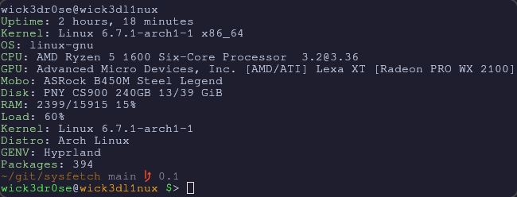

<div align="center">
<h1>Infetch</h1>
<p>A super tiny system information fetch script written in BASH using nerd fonts</p>
</img>
<a href='#'></img><a/>
<a href='#'></img><a/>
<a href='#'></img><a/>
<br/>

## Installation
Download sysfetch

```bash
git clone https://github.com/Alce-tar-gz/infetch; cd ${_##*/}
```

Install to $PATH (optional)
```bash

mv sysfetch infetch
cp infetch /usr/bin/local/
```

---

## Usage
Execute script from within downloaded directory
```bash
./sysfetch
```

Or with BASH
```bash
bash sysfetch
```

Otherwise execute infetch from anywhere if it's in $PATH
```bash
infetch
```

Infetch can be executed in an infinite loop, with a delay, live updating the output every N seconds
```bash
infetch <N>
```

Press Ctrl+C or close terminal to kill the script

---

## Contributing
Make a change; Submit that bitch with a relevant message, e.g. `git commit -m 'issus fix #3'`
